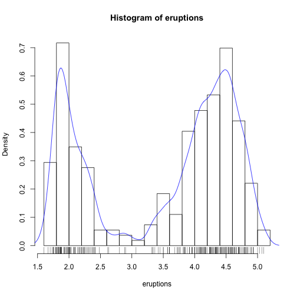
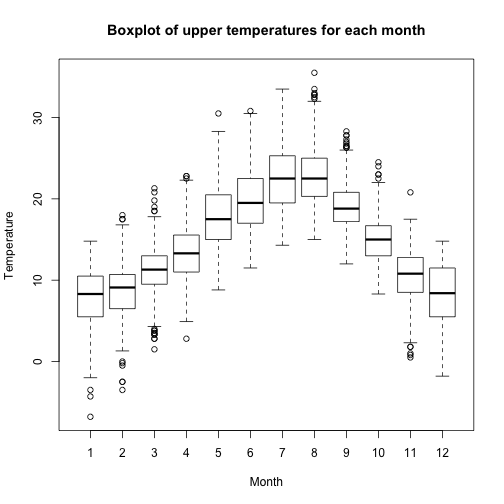
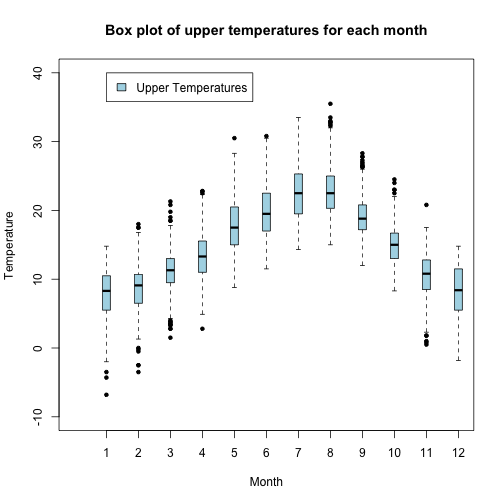
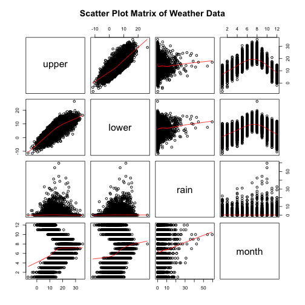

Lab 1
========================================================
1. Summary for graph in Part A
-------------------------------
### 1.1 Histogram

```r
attach(faithful)
hist(eruptions, seq(1.6, 5.2 ,0.2), prob=TRUE)
lines(density(eruptions, bw = 0.1), col = "blue")
rug(eruptions)
```

 

`hist()` produces the histogram, `density()` provides kernel density estimation, `line()` plots the density on the graph and `rug()` adds the actual data points

### 1.2 Scatter Plot & Regression line

```r
plot(eruptions, waiting, pch = 3, xlab = "Eruptions duration", ylab = "Waiting duration", main = "Scatter Plot with regression lines")
abline(lm(waiting ~ eruptions), col = "blue")
```

 

`plot(x, y)` ouputs the scatter plot, `abline()` add line into the existing plot and `lm()` fits a regression line.

### 1.3 Boxplot

```r
weather <- read.table(paste0(path.expand("~"),"/STAT/stat828/hw/data/weather.txt"),
                      header = TRUE)
attach(weather)
weather$monthF <- factor(month)
plot(weather$monthF, upper, xlab = "Month", ylab = "Temperature",
     main = "Boxplot of upper temperatures for each month")
```

 

`plot(x,y)` outputs a boxplot when x is categorical variable (factor). `is.factor()` can be used to assert if a variable is factor or not.

### 1.4 colorful boxplot

```r
boxplot(upper ~ monthF, data = weather, xlab = "Month", ylab = 'Temperature',
        main = "Box plot of upper temperatures for each month",
        boxwex = 0.25, boxfill = "lightblue", pch = 20, xlim = c(0,12),
        ylim = c(-10, 40))
legend(1, 40, c("Upper Temperatures"), fill = c("lightblue"))
```

 

`boxplot()` outputs a prettier boxplot, data are inputed as formula `y ~ x` where y is the numeric variable and x is the categorical variable. `boxwex` makes boxes narrower, `boxfill` gives it a nice colour. `pch = 20` set the data points to a solid black dot. `xlim` is the range of x axis. `lengend(x,y, legend)` adds legends to the plot, `x,y` are the co-ordinates of the legend position. `legend` is a string to appear.

### 1.5 Scatter Plot Matrix

```r
pairs(weather[-c(5,6)], main = "Scatter Plot Matrix of Weather Data", panel = panel.smooth)
```

 

`pairs()` outputs the scatterplots matrix. `panel = panel.smooth()` adds a smooth function to each of the panels. `weather[-c(5,6)]` removes the 5th and 6th column of weather dataset.

2. What I have done of Maindonald and Braun Advanced.R script
-----------------------------------------

```r
## search attached objects
search()
```

```
##  [1] ".GlobalEnv"        "weather"           "faithful"         
##  [4] "package:knitr"     "package:stats"     "package:graphics" 
##  [7] "package:grDevices" "package:utils"     "package:datasets" 
## [10] "package:methods"   "Autoloads"         "package:base"
```

```r
## workspace mangement
## save & load Objects
save(weather, file = "lab1.weather.RData")
rm(list = ls())
attach(paste0(getwd(),"/lab1.weather.RData"))
ls(pos = 2)
```

```
## [1] "weather"
```

```r
load(file = "lab1.weather.RData")
ls(list = ls(all = TRUE)) # to display hidden object like '.XXX'
```

```
## Error in ls(list = ls(all = TRUE)): unused argument (list = ls(all = TRUE))
```

```r
xy <- matrix(rnorm(60000), nrow = 600)
xy.rowrange <- apply(xy, MARGIN = 1, FUN = range) # MARGIN means the axis apply to
save(xy, xy.rowrange, file = "xy.RData")

save.image() # save the whole workspace

## data input and output
unique(count.fields("../data/weather.txt")) # check the number of columns of a file
```

```
## [1] 5
```

```r
write.table(weather, file = "weather2.txt", sep = '|', quote = FALSE)

## database connection

## string functions
substring("abcdefg", 5,7)
```

```
## [1] "efg"
```

```r
nchar("abcde")
```

```
## [1] 5
```

```r
strsplit("abc|def|ggg", split = '|')
```

```
## [[1]]
##  [1] "a" "b" "c" "|" "d" "e" "f" "|" "g" "g" "g"
```

```r
## anonymous functions
#sapply(weather, FUN = function(x)

## working with date and time
dd <- as.Date(c("2015-02-28", "2014-02-28"))
diff(dd)
```

```
## Time difference of -365 days
```

```r
dd <- as.Date(c("2015-02-28", "2015-02-29"))
diff(dd)
```

```
## Time difference of NA days
```

```r
as.Date("1/1/1999", format = "%d/%m/%Y")
```

```
## [1] "1999-01-01"
```

```r
julian(dd)
```

```
## [1] 16494    NA
## attr(,"origin")
## [1] "1970-01-01"
```

```r
weekdays(dd)
```

```
## [1] "Saturday" NA
```

```r
months(dd)
```

```
## [1] "February" NA
```

```r
quarters(dd)
```

```
## [1] "Q1"  "QNA"
```

```r
format(dd, format = "%b %d %Y")
```

```
## [1] "Feb 28 2015" NA
```

```r
format(dd, format = "%a %A %b %B %d %m %y %Y")
```

```
## [1] "Sat Saturday Feb February 28 02 15 2015"
## [2] NA
```

```r
startOfMonth <- seq(from = as.Date("2015-03-01"), by = "1 month", length = 24)
startOfMonth
```

```
##  [1] "2015-03-01" "2015-04-01" "2015-05-01" "2015-06-01" "2015-07-01"
##  [6] "2015-08-01" "2015-09-01" "2015-10-01" "2015-11-01" "2015-12-01"
## [11] "2016-01-01" "2016-02-01" "2016-03-01" "2016-04-01" "2016-05-01"
## [16] "2016-06-01" "2016-07-01" "2016-08-01" "2016-09-01" "2016-10-01"
## [21] "2016-11-01" "2016-12-01" "2017-01-01" "2017-02-01"
```
