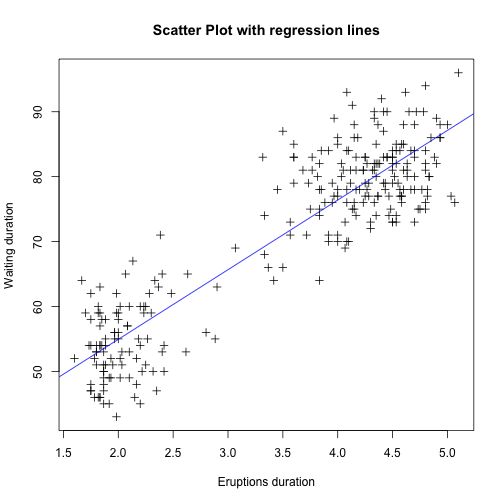

Lab 1
========================================================
1. Summary for graph in Part A
--
### 1.1 Histogram

```r
attach(faithful)
hist(eruptions, seq(1.6, 5.2 ,0.2), prob=TRUE)
lines(density(eruptions, bw = 0.1), col = "blue")
rug(eruptions)
```

 

`hist()` produces the histogram, `density()` provides kernel density estimation, `line()` plots the density on the graph and `rug()` adds the actual data points

### 1.2 Scatter Plot & Regression line

```r
plot(eruptions, waiting, pch = 3, xlab = "Eruptions duration", ylab = "Waiting duration", main = "Scatter Plot with regression lines")
abline(lm(waiting ~ eruptions), col = "blue")
```

 

`plot(x, y)` ouputs the scatter plot, `abline()` add line into the existing plot and `lm()` fits a regression line.

### 1.3 Boxplot

```r
weather <- read.table("/Users/yangzhou/STAT/stat828/hw/data/weather.txt", 
                      header = TRUE)
attach(weather)
weather$monthF <- factor(month)
plot(weather$monthF, upper, xlab = "Month", ylab = "Temperature", 
     main = "Boxplot of upper temperatures for each month")
```

 

`plot(x,y)` outputs a boxplot when x is categorical variable (factor). `is.factor()` can be used to assert if a variable is factor or not.

### 1.4 colorful boxplot

```r
boxplot(upper ~ monthF, data = weather, xlab = "Month", ylab = 'Temperature', 
        main = "Box plot of upper temperatures for each month",
        boxwex = 0.25, boxfill = "lightblue", pch = 20, xlim = c(0,12), 
        ylim = c(-10, 40))
legend(1, 40, c("Upper Temperatures"), fill = c("lightblue"))
```

 

`boxplot()` outputs a prettier boxplot, data are inputed as formula `y ~ x` where y is the numeric variable and x is the categorical variable. `boxwex` makes boxes narrower, `boxfill` gives it a nice colour. `pch = 20` set the data points to a solid black dot. `xlim` is the range of x axis. `lengend(x,y, legend)` adds legends to the plot, `x,y` are the co-ordinates of the legend position. `legend` is a string to appear.

### 1.5 Scatter Plot Matrix

```r
pairs(weather[-c(5,6)], main = "Scatter Plot Matrix of Weather Data", panel = panel.smooth)
```

 

`pairs()` outputs the scatterplots matrix. `panel = panel.smooth()` adds a smooth function to each of the panels. `weather[-c(5,6)]` removes the 5th and 6th column of weather dataset.
